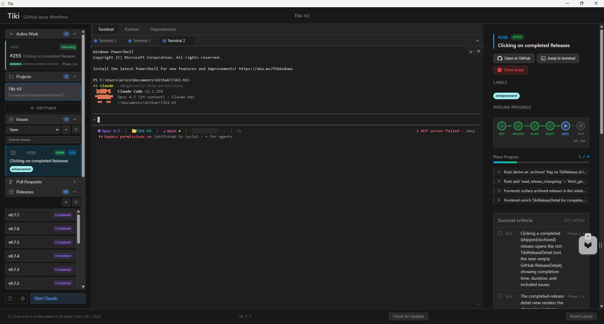
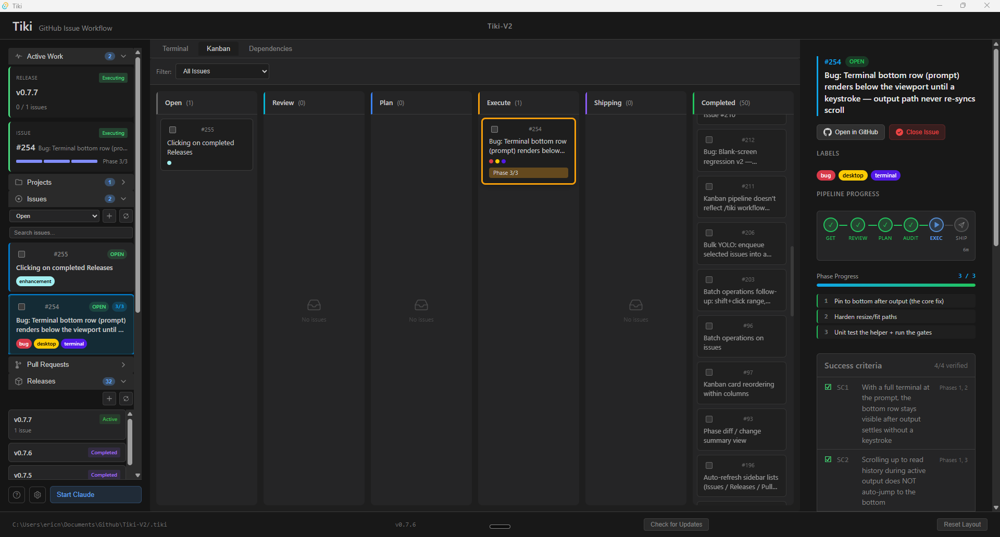
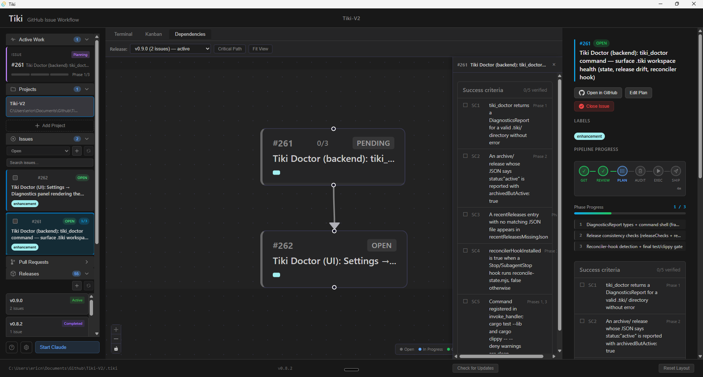

# Tiki

**A GitHub-issue-centric workflow framework for [Claude Code](https://claude.ai/code).**

Tiki turns a GitHub issue into a shipped commit through a deterministic pipeline — **GET → REVIEW → PLAN → AUDIT → EXECUTE → SHIP** — and gives you a desktop app that shows exactly where every issue is in that pipeline in real time.



---

## What is Tiki?

LLM coding agents struggle with anything bigger than a single prompt. Context fills up, work drifts, success criteria get forgotten halfway through. The usual fix is to bolt on more prompting — but the real problem is that the **shape** of going from "GitHub issue" to "shipped code" is a structured pipeline with clear handoff points, and most agent tooling treats it as one blob.

Tiki encodes that pipeline as workflow commands you run inside Claude Code. Each step runs in **fresh context** via sub-agents, so you can take a 12-phase issue from a cold start without ever bumping a context limit. State lives in `.tiki/state.json` so a crash, restart, or context compaction never loses your place. And the desktop app watches that state file and renders the pipeline live — kanban columns move, success criteria tick green, terminals associate with the work they're running.

Two pieces ship together:

| Product | What it is | Where it lives |
| --- | --- | --- |
| **Tiki Framework** | A Claude Code plugin that adds `/tiki:*` workflow commands | [`packages/framework/`](packages/framework/) |
| **Tiki Desktop** | A Tauri (React + Rust) app that visualizes the pipeline | [`apps/desktop/`](apps/desktop/) |

They share a version number and ship together, but you can use either alone — the framework works without the desktop app, and the desktop app works against any project that has a `.tiki/` directory.

---

## The pipeline

```text
GET ──▶ REVIEW ──▶ PLAN ──▶ AUDIT ──▶ EXECUTE ──▶ SHIP
                                                    │
              (or /tiki:yolo to run all six)        │
                                                    ▼
                                              commit · push · close
```

Each step is its own slash command:

- **`/tiki:get N`** — fetches issue N from GitHub, writes the initial state entry
- **`/tiki:review N`** — analyzes the issue, derives explicit success criteria
- **`/tiki:plan N`** — breaks the work into numbered phases with file lists and dependencies
- **`/tiki:audit N`** — validates the plan before any code is touched (file conflicts, missing deps, etc.)
- **`/tiki:execute N`** — runs each phase in a fresh sub-agent, verifies against the success criteria, advances state between phases
- **`/tiki:ship N`** — commits, pushes, closes the issue, appends to history
- **`/tiki:yolo N`** — runs all six in sequence, pausing only on audit failure or phase verification failure

The output of each step feeds the next: REVIEW's success criteria become EXECUTE's verification gate; PLAN's phase list becomes EXECUTE's loop. You can run steps individually (intervene at any point) or hand the whole pipeline to `/tiki:yolo`.

---

## Three views in the desktop app

The desktop app gives you three complementary views of the same `.tiki/state.json`. Switch between them with `Ctrl+1`/`Ctrl+2`/`Ctrl+3` or the tabs at the top of the center pane.

### Terminal view — run and watch live


The default view. Open a Claude Code terminal in the center pane, run `/tiki:yolo 211`, and watch the right panel light up: phase progress (`2/5` filled, executing), success criteria ticking green as the agent verifies each one, and a **Jump to terminal** affordance that takes you back to the conversation if you need to step in. The left sidebar shows everything else you're working on — Active Work, Issues, Pull Requests, Releases — so multi-tasking across issues stays sane.

### Kanban view — see the pipeline



Six columns mirroring the six pipeline steps. Cards move automatically as `/tiki:*` commands advance each issue's state — no manual dragging required. You **can** drag a card backward (e.g. Shipping → Execute if a regression shows up), and the move dispatches the appropriate command to the active terminal. The right panel shows the same live detail as the Terminal view; the left sidebar is unchanged. This is the view to keep open during a multi-issue release to see what's queued, what's mid-execute, what's blocked.

### Dependencies view — visualize relationships



When one issue has to ship before another, declare it in the issue body (`Depends on #261`) and Tiki picks it up. The Dependencies tab renders the resulting graph so you can see at a glance which issues are blocking which. `/tiki:release vX.Y` reads the same edges to schedule issues in topological order. Click a node to inspect its plan, status, and success criteria in the right panel.

---

## Install

### Desktop app (most users)

Download the installer for your platform from the [latest release](https://github.com/Eric-Ness/Tiki-V2/releases/latest):

- **Windows**: `Tiki_<version>_x64-setup.exe` (NSIS) or `Tiki_<version>_x64_en-US.msi`
- **macOS**: `Tiki_<version>_x64.dmg` (Intel) or `Tiki_<version>_aarch64.dmg` (Apple Silicon)
- **Linux**: `Tiki_<version>_amd64.deb`, `.AppImage`, or `Tiki-<version>-1.x86_64.rpm`

All artifacts are signed with a minisign keypair. The app auto-updates from the same release feed on launch — you don't need to download manually again after the first install.

### Framework (Claude Code plugin)

Inside Claude Code, install the plugin from this repository:

```text
/plugin install tiki@Eric-Ness/Tiki-V2
```

Or, for a local development install pointing at your clone:

```text
/plugin install tiki@./packages/framework
```

Once installed, the `/tiki:*` commands are available in any Claude Code session.

---

## Workflow commands reference

| Command | Description |
| --- | --- |
| `/tiki:get <N>` | Fetch a GitHub issue and initialize state |
| `/tiki:review <N>` | Analyze requirements, derive success criteria |
| `/tiki:plan <N>` | Break issue into executable phases |
| `/tiki:audit <N>` | Validate the plan before execution |
| `/tiki:execute <N>` | Run phases in fresh sub-agent contexts |
| `/tiki:ship <N>` | Commit, push, close the GitHub issue |
| `/tiki:yolo <N>` | Full automated pipeline (all of the above) |
| `/tiki:release <ver>` | Execute a release grouping multiple issues |
| `/tiki:research <topic>` | Capture domain knowledge into `.tiki/research/` for future sub-agents to consume |
| `/tiki:version` | Show installed versions, check for updates |

---

## State system

All Tiki workflow state lives in a `.tiki/` directory at the root of the project you're working on:

```text
.tiki/
  state.json              # central state — active work, history, transitions
  config.json             # project-local config (parallel execution, auto-heal, etc.)
  plans/
    issue-N.json          # phase definitions per issue
    archive/              # completed issue plans
  releases/
    vX.Y.Z.json           # active release groupings
    vX.Y.Z-changelog.md   # release changelog (auto-used as GitHub release body)
    archive/              # shipped releases
  research/
    *.md                  # domain knowledge docs (passed into sub-agent prompts)
  backups/                # automatic state.json snapshots before destructive ops
  hooks/
    hooks.json            # lifecycle hooks registry (pre-execute, phase-start, etc.)
```

State mutation goes through one of two shims so transitions stay legal and atomic:

- **`packages/framework/scripts/state.mjs`** — Node CLI used by framework commands
- **`apps/desktop/src-tauri/src/state_transition.rs`** — Rust IPC used by the desktop app

Both mirror the canonical transition table at [`packages/shared/src/types/transitions.ts`](packages/shared/src/types/transitions.ts). Direct edits to `state.json` are discouraged outside the two narrow exceptions documented in `ship.md` and `execute.md`.

---

## Development

### Prerequisites

- **Node.js** ≥ 20
- **pnpm** ≥ 9
- **Rust** (stable)
- **Windows**: use the "x64 Native Tools Command Prompt for VS 2022" for Tauri builds. `pnpm install` may need to run from an elevated shell — see [CLAUDE.md](CLAUDE.md) for the NTFS reparse-point gotcha.

### Setup

```bash
pnpm install
```

### Common commands

```bash
# Build all packages (uses tsc -b — stricter than tsc --noEmit)
pnpm build

# Type-check all packages (no emit)
pnpm typecheck

# Run desktop in dev mode (from apps/desktop)
pnpm tauri:dev

# Build a release binary for the current platform (from apps/desktop)
pnpm tauri:build

# Lint the desktop frontend (from apps/desktop)
pnpm lint

# Bump version across every file in the workspace
pnpm version-bump 0.9.3
```

### Tests

The PR workflow (`.github/workflows/pr.yml`) runs both suites on every PR.

```bash
# Full suite from the repo root (vitest + cargo test + node:test)
pnpm test

# TypeScript only (vitest for shared + desktop + framework)
pnpm test:ts

# Rust only (cargo test for apps/desktop/src-tauri)
pnpm test:rust

# Watch mode (desktop frontend)
pnpm -C apps/desktop test:watch
```

What's currently covered:

- **TypeScript (vitest)** — Zustand stores, kanban routing, split-tree helpers, fuzzy match, terminal hooks, command palette filtering, persistence layers
- **Rust (cargo test)** — `state_format_compat` integration tests pin every historical shape of `state.json` so the serde legacy shims can't regress, plus unit tests for the typed state-transition IPC and the filesystem-utility helpers
- **Framework (node:test)** — Source-scan regression tests, including a coverage assertion that every `state.mjs transition` call in a command markdown pairs with a `--to-step` flag

If you add a new module under `apps/desktop/src/stores/` or `apps/desktop/src/components/`, drop a `*.test.ts` next to it. Vitest's `include` glob is `src/**/*.test.{ts,tsx}`.

---

## CI/CD and releases

Releases trigger on a `v*` tag push, or via the GitHub Actions workflow dispatch UI.

```bash
git tag v0.9.3
git push origin v0.9.3
```

The release workflow ([`.github/workflows/release.yml`](.github/workflows/release.yml)):

1. Runs the test suite as a pre-deploy gate
2. Builds desktop binaries for **macOS** (Apple Silicon + Intel), **Linux**, and **Windows**
3. Signs all artifacts with the Tauri signing key
4. Generates `latest.json` for the auto-updater
5. Creates a GitHub Release with all assets attached and the changelog body from `.tiki/releases/<tag>-changelog.md`

**Most release work happens through `/tiki:release vX.Y.Z`**, which runs the version bump, opens the release PR, watches PR CI, merges, and tags — so you usually don't run `git tag` by hand. See `packages/framework/commands/release.md` for the full flow.

### Auto-update

The desktop app uses the [Tauri Updater Plugin](https://v2.tauri.app/plugin/updater/):

- On launch, a silent background check runs against `releases/latest/download/latest.json`
- If a newer signed artifact exists, the app prompts to install and relaunches
- Manual check: footer "Check for Updates" button

### Signing keys

All release artifacts are signed with a minisign keypair. The public key is embedded in [`apps/desktop/src-tauri/tauri.conf.json`](apps/desktop/src-tauri/tauri.conf.json) under `plugins.updater.pubkey`; the private key and password live in repository secrets (`TAURI_SIGNING_PRIVATE_KEY`, `TAURI_SIGNING_PRIVATE_KEY_PASSWORD`).

To generate a new keypair:

```bash
pnpm tauri signer generate -w ~/.tauri/tiki.key
```

Then update the pubkey in `tauri.conf.json` and add both secrets to the GitHub repository settings.

---

## Architecture

Four design ideas do most of the load-bearing work:

- **GitHub as the source of truth.** Issues, milestones, and PRs live in GitHub. Tiki doesn't reinvent issue tracking — it orchestrates work against what's already there.
- **Fresh context per phase.** Each execute phase runs in its own sub-agent invocation. Phase summaries carry forward as text; the agent never accumulates context across phases.
- **One state file, one shape.** `.tiki/state.json` is the single source of truth for active work. Both products read it; both products mutate it through the same transition table.
- **Multi-context by default.** Multiple terminals can run different issues in parallel against the same project — terminal IDs are tracked per work item so the detail panel always knows which terminal is running which issue.

For the full architecture document — including the parallel-execution algorithm, lifecycle hooks, error recovery, and the desktop app's component layout — see [docs/DESIGN.md](docs/DESIGN.md).

---

## Documentation

- [docs/DESIGN.md](docs/DESIGN.md) — Full architecture and design (workflow internals, IPC, state machine, parallel execution)
- [docs/HOOKS.md](docs/HOOKS.md) — Lifecycle hook system: registry, env vars, block-vs-warn policy
- [docs/PLANNING-NOTES.md](docs/PLANNING-NOTES.md) — Planning context and handoff notes
- [docs/ENHANCEMENT-IDEAS.md](docs/ENHANCEMENT-IDEAS.md) — Backlog of small/medium enhancements
- [CHANGELOG.md](CHANGELOG.md) — Human-readable release history
- [CLAUDE.md](CLAUDE.md) — Project guidance for Claude Code (build commands, gotchas, conventions)
